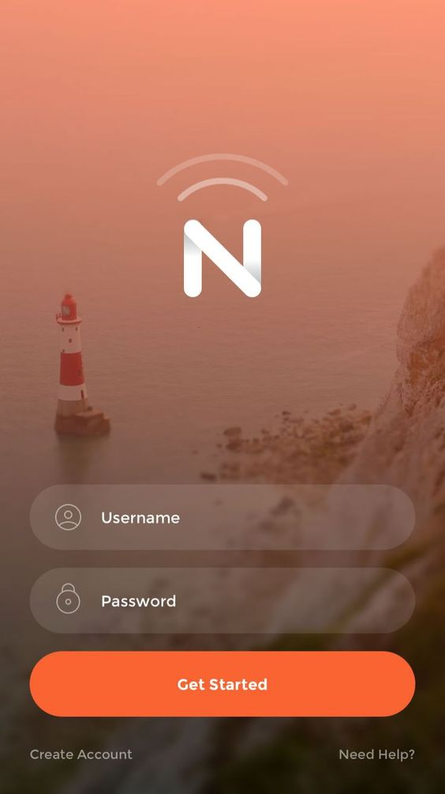

# 一个登陆页面
> 根据图片实现UI,最好实现响应式布局


目标：
Goal:
1. `Div` tag layout exercise;
2.


## Step 1.
1. What's `Responsive layout`
    1. Responsive Web Design makes your web page look good on all devices (desktops, tablets, and phones).
        > 通过各种尺寸的设备浏览网站获得良好的视觉效果的方法
    2. Setting The Viewport
        >
        ```html
            <meta name="viewport" content="width=device-width, initial-scale=1.0">
        ```
2. Responsive -> Image  
    [demos](./samples/responsive_images.html)
3. Responsive -> Text  
    [demos](./samples/responsive_text.html)
4. Responsive -> Media Queries  
    [demos & knowledge](./samples/responsive_media_queries.html)
5. Responsive -> Full Example  
    [demos & knowledge](./samples/responsive_full.html)
    
## Step 2.
Write Page like this;
>   

1. You can use anything resource you want. or change other UI Design Image;
2. Don't use `Bootstrap`;
3. I wrote [Demo at here](./responsive_homework/index.html)